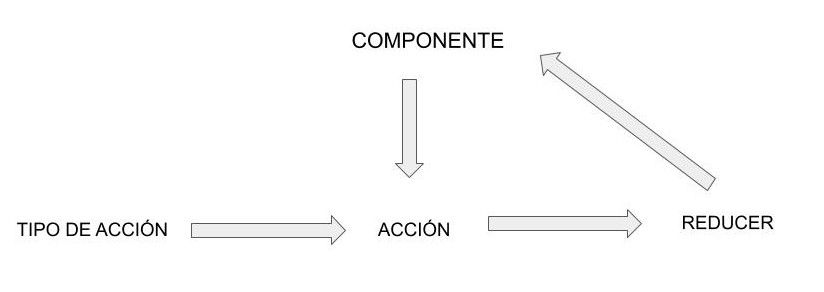

# Reducer

## Definición
    En el contexto de React, un reductor es una función que se utiliza junto con el patrón de diseño Redux para gestionar el estado de una aplicación. Un reductor recibe el estado actual y una acción, y devuelve un nuevo estado. Esto permite una gestión sencilla y predecible del estado de la aplicación, lo que facilita la creación de aplicaciones complejas.
    
## Patrón
